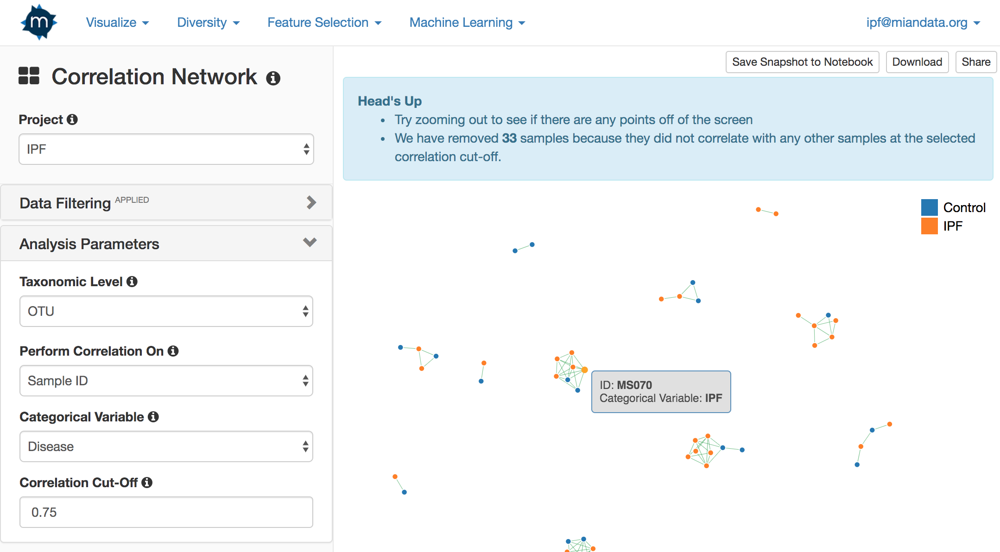

# Correlation Network

### Used For

* Creating a co-correlation network that shows the most positively and negatively correlated samples or taxonomic groups/OTUs \(grouped at the indicated taxonomic level\). Each link has a value between -1 and 1 inclusive

### Visualization Parameters

#### Taxonomic Level

The taxonomic level to aggregate the OTUs at. The OTUs will be grouped together \(by summing the OTU values\) at the selected taxonomic level before the analysis is applied.

#### Perform Correlation On

Indicate whether to create a network based on the correlations between samples or between taxonomic groups/OTUs.

#### Categorical Variable

Create comparative sample groups based on categorical variables uploaded in the metadata file. 

Optionally create a categorical variable from a quantitative variable by using the Quantile Range feature on the Projects home page. 

Each sample group is assigned its own color.

#### Correlation Cut-Off

Determines when to draw a correlation line between two nodes in the network. This cutoff is based on the absolute value of the Pearson product-moment correlation coefficient.

### Interactive Elements

* Hover over each point to determine the sample ID and corresponding sample group
* Hover over each link to determine the correlation strength
* Drag the network to rearrange

### Additional Features

* **Save Snapshot**: Save the visualization to the experiment notebook
* **Download**: Downloads the visualization as a PNG file
* **Share**: Creates a shareable link that allows you to share the visualization with others

